# Ledger — Database Analytics Chatbot

Ledger is a chat-based analytics assistant that connects to a MySQL database, answers natural-language questions about your data, and builds a live results page of insights — written explanations alongside auto-generated bar, line, pie, and scatter charts — as it investigates.

Under the hood, the assistant queries the database through the **Model Context Protocol (MCP)**, using a set of tools it can call on its own: running read-only SQL, writing summary paragraphs, and adding charts to the results page, all in the order it decides to present them.

> 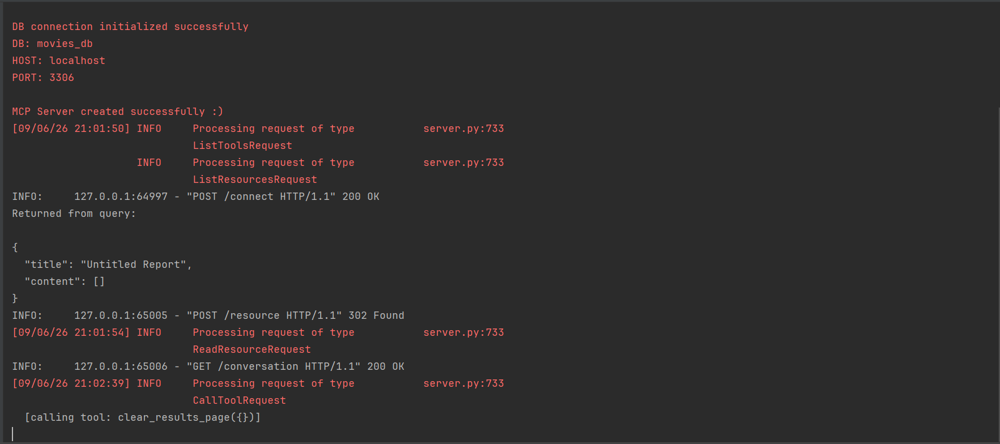
> 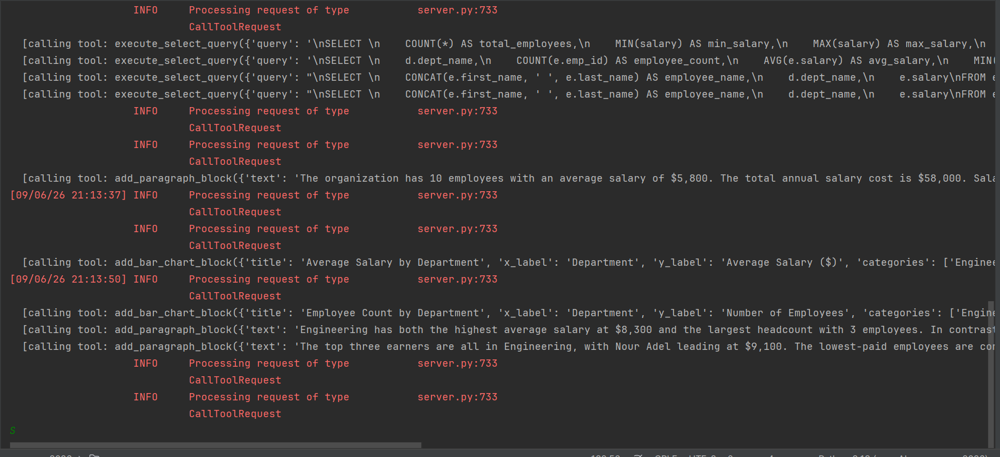
---

## Features

- **Conversational database querying** — ask questions in plain English; the assistant writes and runs the SQL itself (read-only, `SELECT`-only, enforced server-side).
- **Auto-generated results page** — the assistant composes a page of paragraphs and charts in the exact order it builds them, using a discriminated set of content-block types:
  - Paragraph blocks (written insights)
  - Bar charts
  - Line charts
  - Pie charts
  - Scatter charts
- **Markdown-rendered assistant replies** — chat responses support tables, fenced code blocks, and line breaks.
- **Persistent conversation & report** — reloading the page restores the full chat history and the current results page from the running session.
- **Connection management UI** — a dedicated "Connect a database" screen to test and save credentials before entering the chat, plus a disconnect option to switch databases.
- **Read-only safety** — the SQL execution tool rejects any statement that isn't a single `SELECT`, so the assistant can never modify or delete data.

---

## Architecture

The project is split into three cooperating services:

> 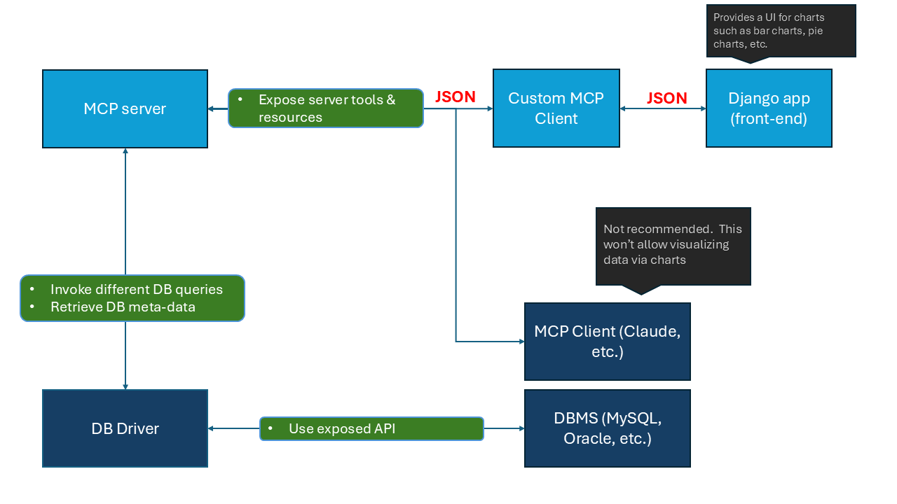

- **Django** serves the pages (connection screen, main chat + results screen), renders chat history server-side (Markdown → HTML for assistant messages), and proxies API calls to the FastAPI service.
- **FastAPI** owns the live MCP client session and the tool-calling agent loop against the LLM. A dedicated background task manages the MCP subprocess connection's full lifecycle (open → use → close), which is required for correct behavior under Windows' asyncio subprocess model.
- **MCP Server** (built with `FastMCP`) exposes the actual tools — running SQL, and building the results page — plus a `report://current` resource exposing the current report as JSON.

---

## Tech stack

**Backend / services**
- [Django](https://www.djangoproject.com/) — UI-serving web app, view layer, templating
- [FastAPI](https://fastapi.tiangolo.com/) — MCP client service and agent loop, served via [Uvicorn](https://www.uvicorn.org/)
- [MCP Python SDK](https://github.com/modelcontextprotocol/python-sdk) (`mcp`, `mcp.server.fastmcp.FastMCP`) — client/server implementation of the Model Context Protocol
- [OpenAI Python SDK](https://github.com/openai/openai-python) — LLM chat completions (OpenAI-compatible endpoint, configurable model/base URL)
- [Pydantic](https://docs.pydantic.dev/) — data validation for all report content-block schemas (paragraphs, charts) and tool I/O
- [httpx](https://www.python-httpx.org/) — async HTTP client used for Django ⇄ FastAPI communication
- [mysql-connector-python](https://dev.mysql.com/doc/connector-python/en/) — MySQL connectivity for connection testing and query execution
- [python-dotenv](https://pypi.org/project/python-dotenv/) — environment variable management
- [Python-Markdown](https://python-markdown.github.io/) (`markdown`) — renders assistant replies (tables, fenced code, line breaks) to HTML

**Frontend**
- Vanilla JavaScript (`fetch`, DOM APIs) — chat interactions, connection form, live results updates
- [Chart.js](https://www.chartjs.org/) — renders bar, line, pie, and scatter charts from the assistant's structured chart data
- Django Template Language (DTL) — server-side rendering of pages and partials

**Database**
- MySQL — the connected, queried database (read-only access enforced at the tool level)

**Tooling**
- [MCP Inspector](https://github.com/modelcontextprotocol/inspector) (`npx @modelcontextprotocol/inspector`) — used during development to test MCP tools/resources directly, independent of the web app

---

## Setup

### 1. Prerequisites
- Python 3.11+ (Windows, macOS, or Linux)
- A running MySQL server with a database you want to analyze
- Node.js (only if you want to run the MCP Inspector for debugging)

### 2. Clone and create a virtual environment

```bash
git clone <this-repo-url>
cd ledger_analytics
python -m venv .venv
```

Activate it:
```bash
# Windows PowerShell
.venv\Scripts\Activate.ps1

# macOS / Linux
source .venv/bin/activate
```

### 3. Install dependencies

```bash
pip install django djangorestframework fastapi uvicorn httpx mcp openai pydantic mysql-connector-python python-dotenv markdown
```

### 4. Configure environment variables

Create a `.env` file in the project root:

```
API_URL=https://your-openai-compatible-endpoint/v1
API_KEY=your-api-key
MODEL=your-model-name
```

### 5. Run the three services (each in its own terminal)

```bash
# Terminal 1 — FastAPI (MCP client + agent)
python mcp_client/mcp_client.py

# Terminal 2 — Django (UI)
uvicorn clientApp.asgi:application
```

The MCP server itself is spawned automatically as a subprocess by the FastAPI service when you connect a database — you don't need to run it separately.

### 6. Use it

1. Open the Django app in your browser.
2. You'll be redirected to the **connect a database** screen — enter your MySQL credentials and test the connection.
3. Once connected, continue to the chat — ask questions about your data and watch the results page build itself.

---

## Screenshots
> 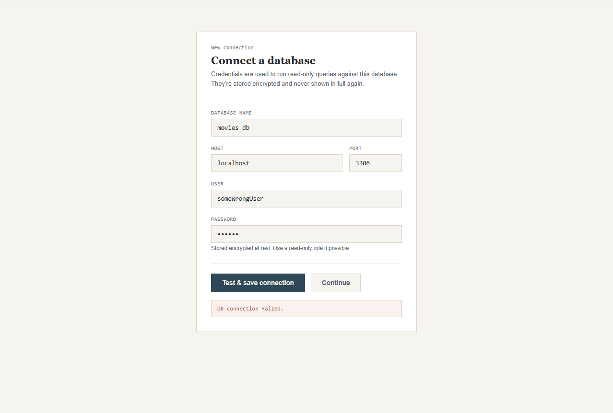
> 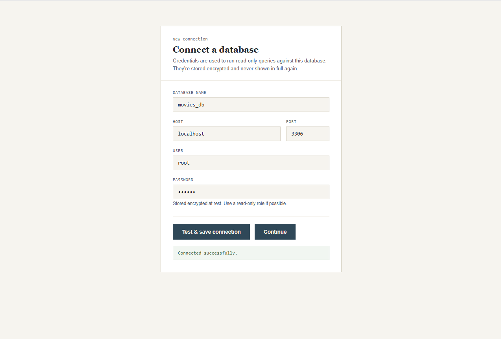
> 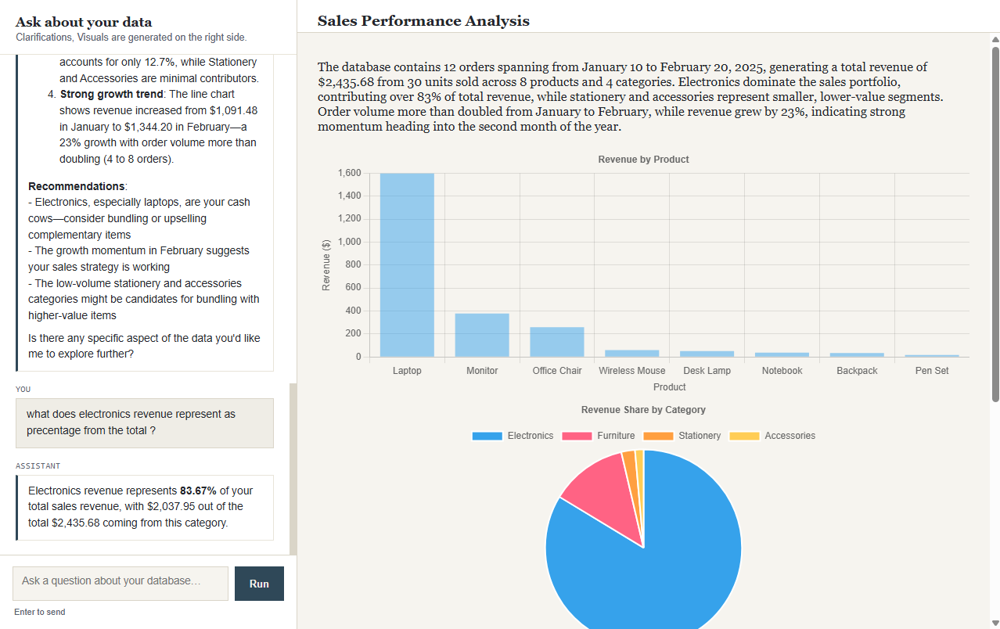
> 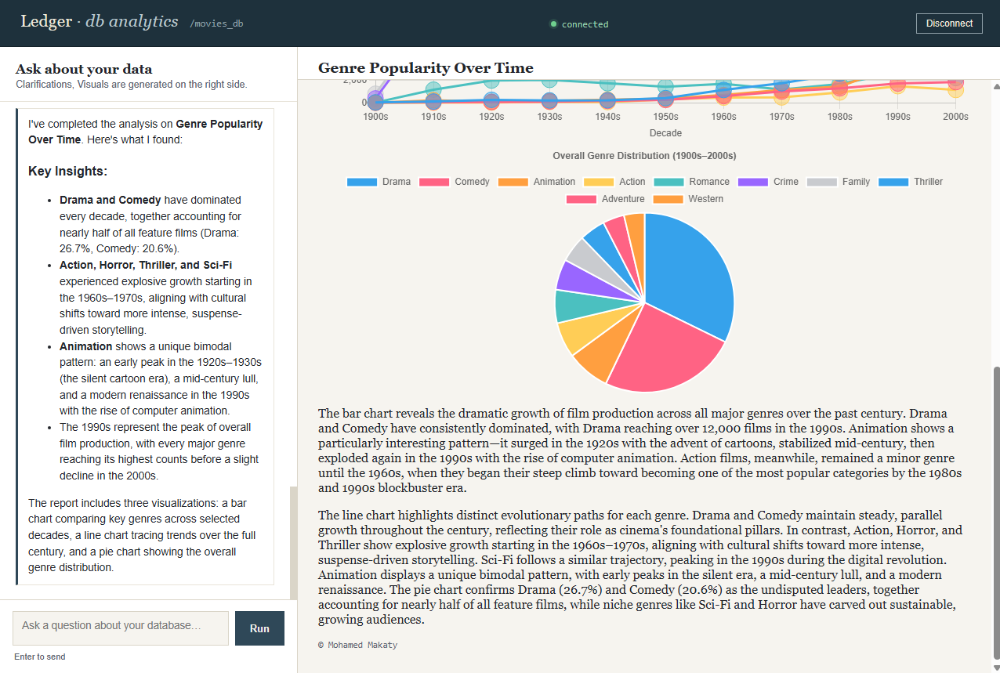
> 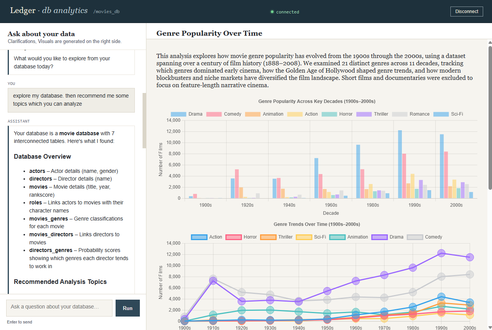
> 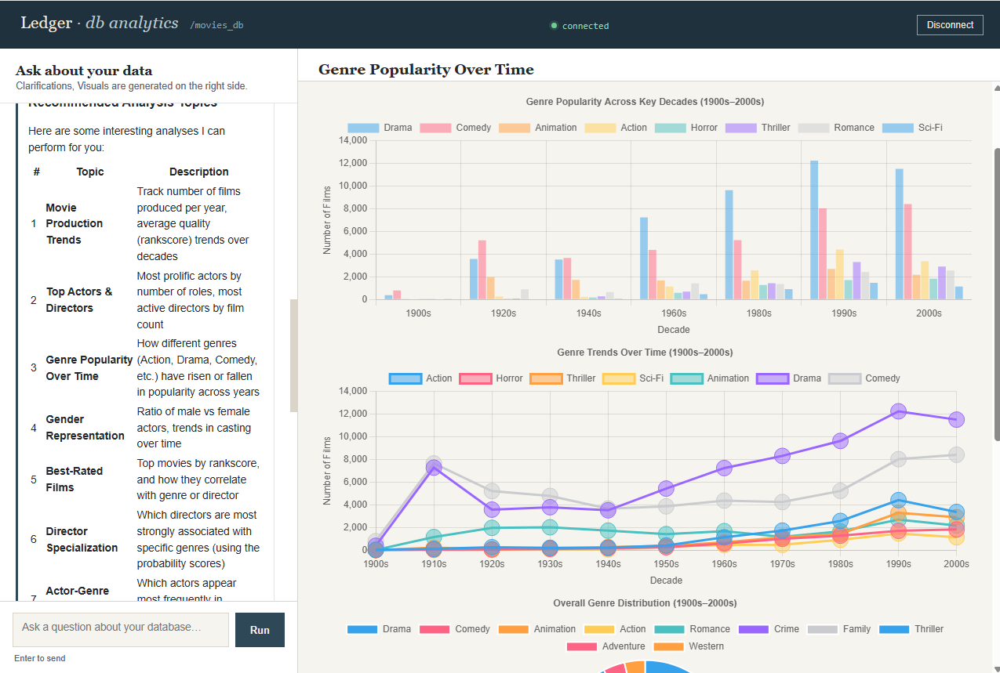
> 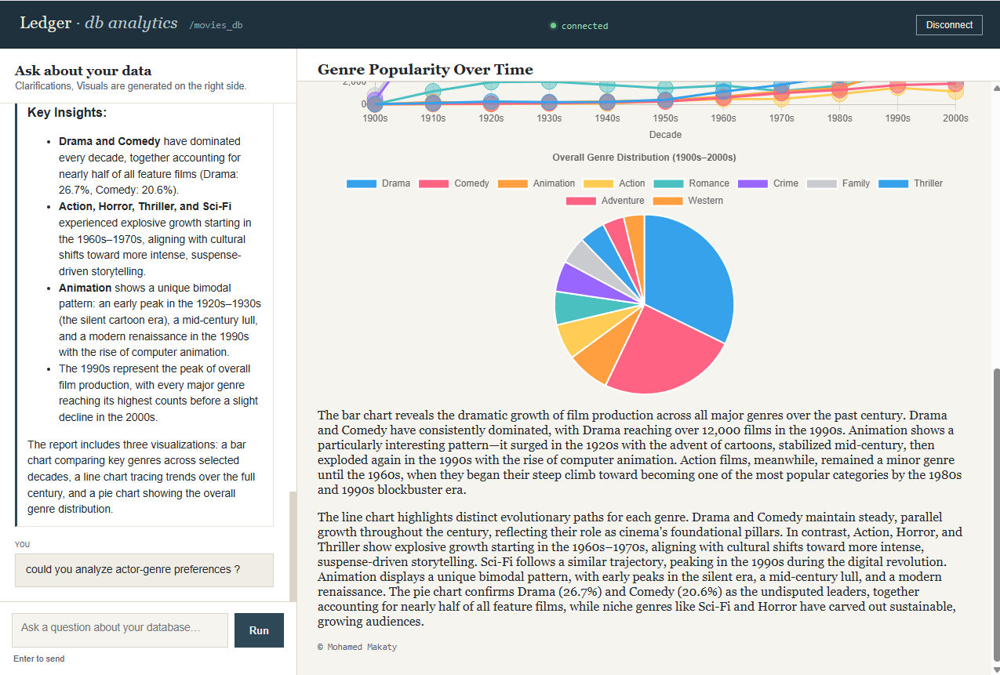
> 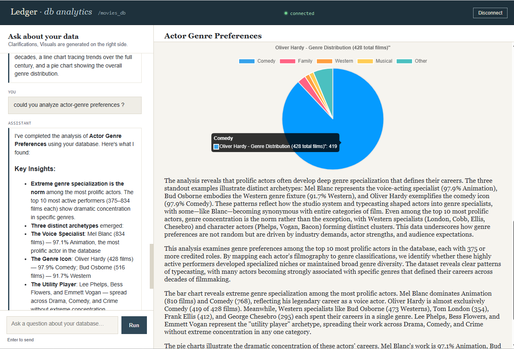
> 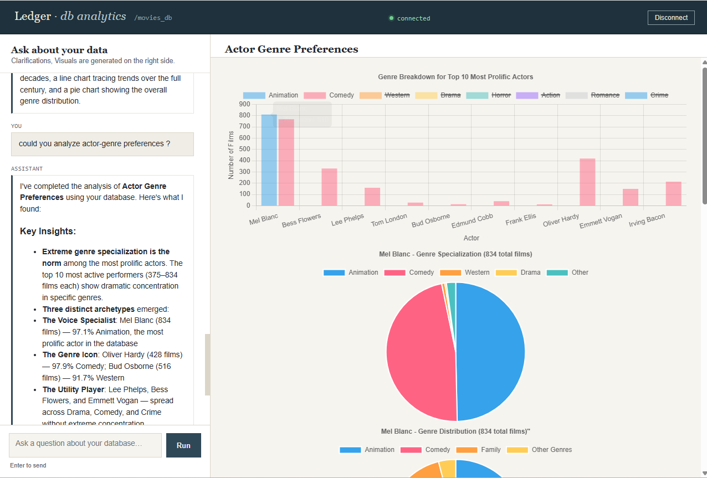


| Connect a database | Chat + results page |
|---|---|
|  |  |

---

## Known limitations

- **Single global session** — the app currently supports one active database connection and one conversation at a time (no per-user session isolation). Suitable for personal/local use; would need session-keyed state for multi-user deployment.
- **Windows subprocess/event loop considerations** — the MCP client's stdio connection requires careful event loop handling on Windows (`ProactorEventLoop`, single-owner background task for the connection lifecycle). This is already handled in `mcp_client.py`, but is worth knowing if you extend the connection-management code.
- **Read-only by design** — the assistant can only run `SELECT` queries; there's no way (by design) for it to modify your data.


